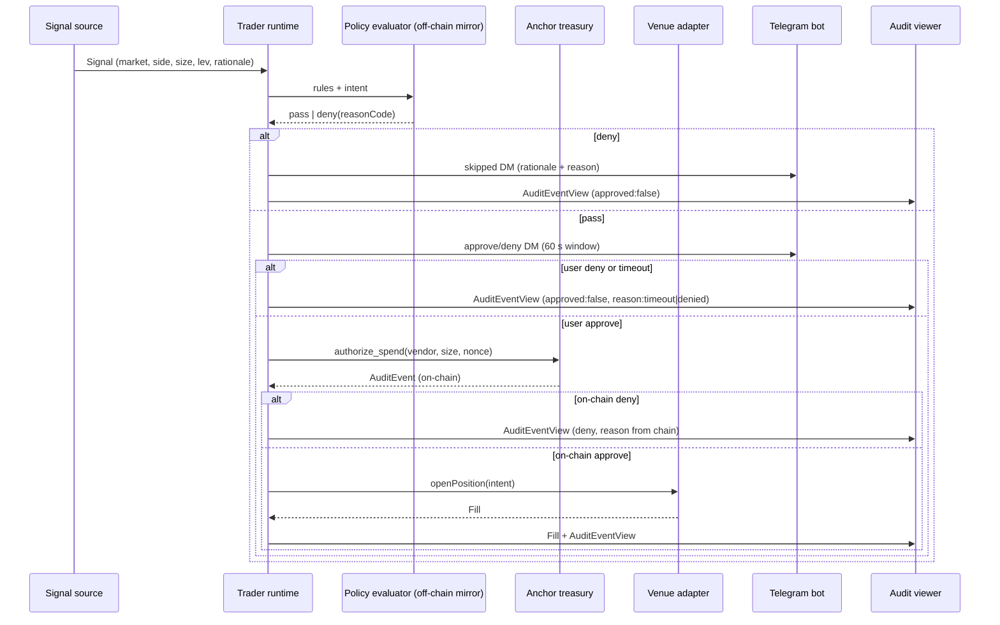

# Agent Runtime — `packages/agent`

> Frozen for D6. The agent runtime is the long-running process that
> listens for signals, evaluates them against rules, routes through
> the venue adapter, and surfaces decisions to the user via Telegram
> and the dashboard.

## What it does

The runtime turns the SDK into a product. A developer who installs
`@trade-on-my-behalf/sdk` gets a `TradeAPI` and calls it; a user who
wants a 24/7 trader installs the runtime, points it at their wallet,
and gets a Telegram bot, a dashboard, and a Telegram-driven
approve/deny loop on top.

The runtime is intentionally thin. The Anchor program is the gate;
the SDK is the ergonomic wrapper; the runtime is the glue.

## Lifecycle



## Module map (sketch)

```text
packages/agent/
├── src/
│   ├── index.ts                # boot: load wallet, rules, venues, telegram
│   ├── signals/
│   │   ├── helius.ts           # webhook receiver: mark price, funding, liquidations
│   │   ├── agentbazaar.ts      # MCP client for paid signals
│   │   ├── manual.ts           # Telegram slash-command (e.g. /long SOL 0.1 3x)
│   │   └── copytrade.ts        # follower relay
│   ├── classifier.ts           # normalizes raw Signal -> TradeIntent
│   ├── evaluator.ts            # off-chain mirror of authorize_spend rules
│   ├── router.ts               # picks venue, builds CPI, submits tx v1
│   ├── venue/
│   │   ├── index.ts            # Venue interface
│   │   ├── jupiter-perps.ts    # primary adapter
│   │   ├── drift.ts            # secondary adapter
│   │   └── zeta.ts             # stretch (D14)
│   ├── telegram/
│   │   ├── bot.ts              # bot father wiring
│   │   ├── bind.ts             # wallet binding flow
│   │   └── notify.ts           # DM templates, approve/deny buttons
│   └── audit/
│       ├── log.ts              # in-memory mirror of AuditEvent stream
│       └── http.ts             # local push to apps/dashboard
```

## Venue interface

```ts
// packages/agent/src/venue/index.ts
export interface Venue {
  readonly name: 'jupiter-perps' | 'drift' | 'zeta';

  openPosition(p: {
    side: 'long' | 'short';
    sizeUsd: number;
    leverage: number;          // bps (500 = 5x)
    market: string;            // e.g. 'SOL-PERP'
  }): Promise<{ signature: string; venuePositionId: string }>;

  closePosition(id: string): Promise<{ signature: string }>;

  listPositions(): Promise<Array<{
    venuePositionId: string;
    market: string;
    side: 'long' | 'short';
    sizeUsd: number;
    leverage: number;
    unrealizedPnlUsd: number;
    openedAt: number;          // unix seconds
  }>>;

  /** Cheapest venue that quotes the market; runtime uses for routing. */
  quote(p: { market: string; side: 'long' | 'short'; sizeUsd: number }): Promise<{
    priceUsd: number;
    feeBps: number;
    available: boolean;
  }>;
}
```

The runtime holds one adapter per whitelisted `VenueId`. `router.ts`
calls `quote` on each in priority order (cheapest fee), picks the
first `available: true`, and routes through it.

## Signal -> Intent flow

A `Signal` is whatever the source wants to send. The runtime
normalizes it to a `TradeIntent` with these invariants:

- `sizeUsd <= rules.maxPositionUsd`. If a signal would exceed, the
  intent is **clamped down** to the cap, not denied. The rationale
  string is updated to note the clamp.
- `leverage <= rules.maxLeverage`. Same clamp.
- `side in {'long', 'short'}`.
- `market` must be available on at least one configured venue.

If `intent.sizeUsd < 1` after clamping, the signal is dropped silently.

## Concurrency model

- One async loop per signal source (`helius.ts`, `agentbazaar.ts`, etc.).
  Each pushes typed `Signal`s into a shared `Channel<TradeIntent>`.
- A single consumer (`router.ts`) reads from the channel, calls
  `evaluator.ts`, and forwards approved intents to the venue.
- Telegram approve/deny is awaited with a 60 s `Promise.race` against
  the user click. On timeout the intent is dropped and a
  `AuditEventView(approved:false, reasonCode: 99 /* timeout */)` is
  emitted. (Reason 99 is runtime-local; the on-chain `REASON_*` set
  is reserved 0..5 today, 0..7 after D7.)

## Rule evaluation order (mirrors on-chain)

The off-chain mirror in `evaluator.ts` runs checks in the same order
as `authorize_spend` so the off-chain deny reasons line up with what
the chain would have said:

1. Vendor in `policy.vendors` → else `REASON_VENDOR_DENIED` (1).
2. `intent.sizeUsd <= per_tx_cap_usdc / 1e6` → else `REASON_PER_TX_CAP` (2).
3. `todayLoss + intent.sizeUsd <= per_day_cap_usdc / 1e6` → else
   `REASON_DAILY_CAP` (3). `todayLoss` is tracked off-chain from
   `Fill.unrealizedPnlUsd` and confirmed by the `AuditEvent` stream.
4. `Clock.slot - created_at_slot <= ttl_slots` → else `REASON_EXPIRED` (4).
5. **D7**: `intent.leverage <= policy.max_leverage_bps` → else
   `REASON_LEVERAGE_EXCEEDED` (6).
6. **D8**: `(peakEquity - nowEquity) / peakEquity * 100 <= killSwitchDrawdownPct`
   → else `REASON_DRAWDOWN_TRIPPED` (7).

The runtime never trusts its own evaluation as final for an *approve*.
It always sends `authorize_spend` and waits for the chain. For a
*deny* the off-chain mirror is the source of truth and no transaction
is sent.

## Boot sequence

```ts
// packages/agent/src/index.ts (sketch)
import { createClient } from '@solana/kit';
import { solanaDevnetRpc } from '@solana/kit-plugin-rpc';
import { signerFromFile } from '@solana/kit-plugin-signer';
import { loadRules } from './rules';
import { bindVenues } from './venue';
import { bindTelegram } from './telegram/bind';
import { startSignalLoops } from './signals';

export async function boot(opts: { keyfile: string; rulesFile: string; rpcUrl?: string }) {
  const wallet = await signerFromFile(opts.keyfile);
  const client = createClient()
    .use(signer(wallet))
    .use(solanaDevnetRpc(opts.rpcUrl));
  const rules = await loadRules(opts.rulesFile);
  const venues = await bindVenues(rules.venues, client);
  const tg = await bindTelegram(wallet);
  await startSignalLoops(client, rules, venues, tg);
}
```

`pnpm --filter @trade-on-my-behalf/agent dev` boots locally with a
devnet keyfile. The same code path runs in production against mainnet
by swapping the RPC plugin.