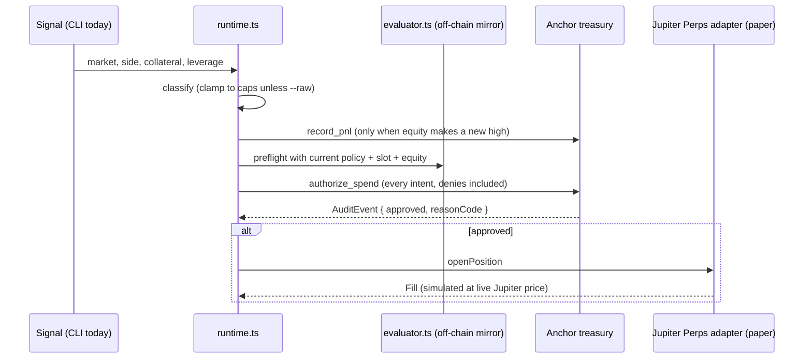

# Agent Runtime — `packages/agent`

> Updated 2026-09-27 (D10) to match the shipped code. Sections marked
> **planned** are not built yet.

The runtime turns a trade signal into an on-chain policy decision and,
if approved, a venue fill. The Anchor program is the gate; the SDK is
the typed wrapper; the runtime is the glue.

## Lifecycle (shipped)



**Every intent goes on-chain, including ones the preflight expects to be
denied.** The deny receipt is the product: it is the public proof that
the rule fired. The off-chain evaluator is a diagnostic — if it disagrees
with the chain the receipt is flagged `mismatch` and the chain's answer
is used. (This supersedes the D6 draft that skipped the transaction for
off-chain denies.)

## Module map (shipped)

```text
packages/agent/src/
├── index.ts               # public exports
├── cli.ts                 # `tomb` CLI (see below)
├── runtime.ts             # createRuntime(): handle(signal), close(id), syncEquity()
├── classifier.ts          # raw Signal -> TradeIntent, optional clamping to caps
├── evaluator.ts           # off-chain mirror of authorize_spend (same order, same integer math)
└── venue/
    ├── index.ts           # Venue interface, MARKETS, PriceFeed
    ├── jupiter-perps.ts   # JupiterPerpsPaperVenue, FileStore/MemoryStore, PnL math
    └── prices.ts          # JupiterPriceFeed (lite-api.jup.ag/price/v3), StaticPriceFeed
```

**Planned** (not built): signal samplers (RSI, funding, Helius webhooks),
copy-trade relay, rate limiter, SSE bridge for `apps/dashboard`, Drift
adapter, Jupiter Perps live mode.

## Money semantics

- `collateralUsd` is the amount the policy caps (`amount_usdc`). It is
  the most a single position can lose; notional = collateral × leverage.
- Paper equity = cash + Σ(collateral + unrealized PnL). This is the
  `implied_current_equity_usdc` sent with every `authorize_spend` and the
  value `record_pnl` raises the peak to.
- Paper fills charge Jupiter Perps' 6 bps open/close fee. Liquidation is
  not simulated; a position's loss is capped at its collateral.

A useful consequence: with losses capped at collateral, one day's worth
of positions can lose at most `per_day_cap`. With the demo policy
($150/day on $1 000) the 25% kill-switch cannot trip inside a single day;
it guards against losses accumulating across days. The demo tightens the
kill-switch to 5% to show it firing.

## Clamping vs. raw

`classify(signal, policy, clamp)`:

- **clamp on** (default): collateral is cut to `per_tx_cap`, leverage to
  `max_leverage`. A well-behaved agent never asks for more than allowed.
- **clamp off** (`tomb trade --raw`): the intent goes to the chain as-is.
  This is how a buggy or compromised agent behaves, and it is what the
  demo uses to show the chain denying it.

Signals with an unknown market, a bad side, collateral ≤ 0, or leverage
below 1x are dropped before any transaction.

## CLI

```text
tomb init-policy   --owner <key> --agent <key> [--per-tx 50] [--per-day 150] [--max-leverage 5] [--kill-pct 25] [--ttl-days 7]
tomb update-policy --owner <key> --agent <key> [--per-tx] [--per-day] [--max-leverage] [--kill-pct] [--ttl-days]
tomb trade         --agent <key> --market SOL-PERP --side long --collateral 40 --leverage 3 [--raw]
tomb positions     --agent <key>
tomb close         --agent <key> --id <positionId>
tomb status        --agent <key>
tomb watch         --agent <key>            # live decoded AuditEvent feed
tomb resolve-venue jupiter-perps [--url]    # is the venue program deployed on this cluster?

Global: --url <rpc> (default $RPC_URL or localhost), --paper-state <file>,
        --paper-cash <usd>, --price SOL-PERP=90[,ETH-PERP=...], --json
```

Run from the repo with `pnpm --filter @trade-on-my-behalf/agent tomb <cmd> ...`,
or run the whole story with `pnpm demo` (local validator, no SOL needed).

## Tests

`pnpm --filter @trade-on-my-behalf/agent test` — 16 offline tests:
evaluator parity with every on-chain reason code (incl. kill-switch
ordering and the daily reset), clamping, the runtime flow against an
in-memory chain (approve → fill, deny → no fill, chain overrides a
wrong preflight), and paper PnL math.
