# Architecture — Trade On My Behalf

> Frozen for D6. **Updated D8.5+** to webapp-first control surface
> (Phantom Connect or Trust Wallet). Telegram bot cut to v3, never.
> See `docs/control-surface.md` for the full webapp design.

This is a documentation-first scaffold. The compiled Anchor program at
`programs/treasury/target/deploy/treasury.so` (209 KB) and its IDL at
`programs/treasury/target/idl/treasury.json` already exist; everything
described below is what the **agent**, **SDK**, and **webapp**
control surface will speak to once code resumes.

The product is an on-chain risk-gated perps agent. The user describes
a setup, walks away, and a trader runtime watches the market, evaluates
signals against rules, and submits trades that cannot break those rules
because the rules are enforced at the **wallet's signing layer** by the
Anchor program. If a trade would violate a rule, the Anchor program
refuses to record it as authorized, regardless of what the signal
source, the runtime, or a compromised dependency tried to do. The
webapp shows the receipts.

## System diagram

```mermaid
flowchart LR
    classDef ext fill:#f5f5dc,stroke:#333,stroke-width:1px;
    classDef runtime fill:#dde7f0,stroke:#333,stroke-width:1px;
    classDef chain fill:#d4f4d4,stroke:#333,stroke-width:1px;
    classDef venue fill:#fde4d4,stroke:#333,stroke-width:1px;
    classDef ui fill:#e4d4fd,stroke:#333,stroke-width:1px;

    user["User intent (RSI / funding / news / LLM)"]:::ext
    signals["Samplers (Helius webhooks / RSI / funding-rate / on-chain metrics)"]:::ext

    runtime["Trader runtime (packages/agent)"]:::runtime
    classifier["Signal classifier + rule evaluator"]:::runtime
    router["Venue router"]:::runtime

    policy["Anchor treasury program (policy gate)"]:::chain
    policyState["Policy PDA (state/mod.rs)"]:::chain
    audit["AuditEvent stream (on-chain)"]:::chain

    venueJ["Jupiter Perps adapter"]:::venue
    venueD["Drift adapter (v2)"]:::venue
    venueZ["Zeta adapter (v3 stretch)"]:::venue

    fills["Fill events (Helius DAS / program logs)"]:::ext
    webapp["Webapp control surface (apps/dashboard) — Phantom Connect or Trust Wallet"]:::ui
    helius["Helius DAS index (audit log source)"]:::ext

    user --> signals
    signals --> runtime
    runtime --> classifier
    classifier -->|rule pass| router
    classifier -->|rule fail| audit
    router -->|authorize_spend| policy
    policy --> policyState
    policy -->|approve| router
    router -->|openPosition| venueJ
    router -->|openPosition| venueD
    router -->|openPosition| venueZ
    venueJ --> fills
    venueD --> fills
    venueZ --> fills
    fills --> audit
    audit --> helius
    helius --> webapp
    webapp -->|user edits rule| runtime
```

## End-to-end data flow

1. **Sampling.** A sampler (Helius webhook for funding-rate or
   liquidation events, an RSI calculator, a funding-rate sampler,
   a copy-trade relay) emits a typed `Sample` into the trader
   runtime. Every `Sample` carries a market, a numeric value, a
   timestamp, and a source identifier. The runtime's skill-runner
   consumes the stream and decides whether to fire a `TradeIntent`.

2. **Classify.** The runtime normalizes the signal into a `TradeIntent`
   and, by default, clamps collateral and leverage to the policy caps
   (`packages/agent/src/classifier.ts`).

3. **Preflight.** The off-chain evaluator (`packages/agent/src/evaluator.ts`)
   mirrors `authorize_spend` — same order, same integer math. It is a
   diagnostic only: it never skips the on-chain call.

4. **Authorize gate.** The runtime sends `authorize_spend` for **every**
   intent, denies included, so each decision leaves a public receipt. The
   program emits an `AuditEvent`; the SDK decodes it from the transaction
   logs. If the chain and the preflight disagree, the chain wins and the
   receipt is flagged.

5. **Venue.** On approve, the Jupiter Perps adapter opens the position.
   **v1 is paper mode**: the fill is simulated at the live Jupiter price
   with the 6 bps fee. On deny, nothing is sent to the venue. When
   equity makes a new high the runtime calls `record_pnl`, which raises
   the on-chain peak the kill-switch measures from.

6. **Audit viewer (planned).** Every `AuditEvent` is indexed by Helius DAS
   (program `4TdJre5rGrGT3Zo5aEfmJmT6wu65BbjFjyLFjrMeJXph`,
   discriminator `241,242,94,109,175,205,78,0`) and surfaced in the
   webapp (`apps/dashboard/`) via SWR refresh (~2 s). The webapp is
   the audit surface for both the user and a downstream auditor.
   Until the webapp ships, `tomb watch` streams the decoded events.

7. **Webapp control.** The user opens the webapp, connects Phantom
   Connect or Trust Wallet, views the policy + audit log + positions,
   and edits rules when needed. Edits trigger an `update_policy`
   instruction signed by the user's wallet. There is **no** human
   approve/deny button for trades — the kernel decides; the webapp
   shows the receipts.

## Reference to IDL instructions

The IDL at `programs/treasury/target/idl/treasury.json` exposes exactly
four instructions; all are documented end-to-end in
`docs/onchain-program.md`:

| Instruction | Discriminator (first 8 bytes) | Purpose |
|---|---|---|
| `create_policy` | `27,81,33,27,196,103,246,53` | Initialize a `Policy` PDA for a wallet. |
| `authorize_spend` | `142,194,48,42,7,177,198,23` | Authorize a single spend; emit an `AuditEvent` either way. |
| `update_policy` | (D7+) | Owner-only. Mutate caps and TTL. |
| `record_pnl` | (D8+) | Owner-only. Update the peak-equity watermark. |

The runtime and SDK treat these as the *only* on-chain surface. Anything
that wants to bypass them is, by definition, bypassing the policy.

## Composability with hackathon primitives

Every external block in the diagram is a primitive the Crypto World's
Fair judges reward:

- **Helius** powers webhooks (signals), DAS (audit indexing for the
  webapp), and Sender (transaction submission with priority fees).
- **Jupiter Perps** is the primary venue router target.
- **Drift** is the secondary venue router target (v2).
- ~~**AgentBazaar** MCP for paid signal marketplace~~ — dropped v1 (D8.5+). See `docs/skills-and-algorithms.md` for the SAS model. A "specialist skill marketplace" is a possible v3 direction.
- **Phantom Connect + Trust Wallet** power wallet auth in the
  webapp. Every layer a primitive the judges reward.
