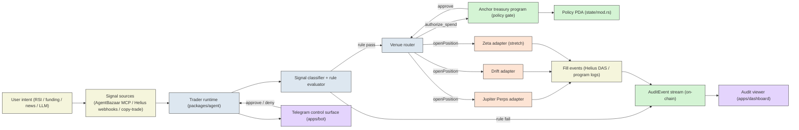

# Architecture — Trade On My Behalf

> Frozen for D6 (this document is the canonical reading path; subsequent
> edits update SPEC.md only when the contract changes).

This is a documentation-first scaffold. The compiled Anchor program at
`programs/treasury/target/deploy/treasury.so` (203 KB) and its IDL at
`programs/treasury/target/idl/treasury.json` already exist; everything
described below is what the **agent**, **SDK**, **dashboard**, and
**Telegram control surface** will speak to once code resumes.

The product is an on-chain risk-gated perps agent. The user describes
a setup, walks away, and a trader runtime watches the market, evaluates
signals against rules, and submits trades that cannot break those rules
because the rules are enforced at the **wallet's signing layer** by the
Anchor program. If a trade would violate a rule, the Anchor program
refuses to record it as authorized, regardless of what the signal
source, the runtime, or a compromised dependency tried to do.

## System diagram

## End-to-end data flow

1. **Signal ingestion.** A signal source (an AgentBazaar MCP server, a
   Helius webhook for funding-rate or liquidation events, a manual
   Telegram slash-command, or a copy-trade relay) pushes a typed
   `Signal` into the trader runtime. Every `Signal` carries a market,
   side, suggested size, suggested leverage, rationale string, and a
   source identifier.

2. **Rule evaluation.** The runtime sends the `Signal` to the off-chain
   policy evaluator (packages/policy-engine) which mirrors the on-chain
   checks in `instructions/authorize_spend.rs`. This is the *fast path*:
   if the evaluator rejects, the trade is skipped locally, no Anchor
   call is made, no fee is paid, and an `AuditEvent` with
   `approved: false` is emitted to the off-chain audit log (the
   on-chain equivalent requires the runtime to call `authorize_spend`
   anyway so the on-chain trail is canonical).

3. **Authorize gate.** For rules that pass off-chain but for which the
   runtime wants the strongest possible receipt, the runtime calls
   `authorize_spend` against the `Policy` PDA. The Anchor program runs
   the same vendor/per-tx/per-day/TTL check as the off-chain mirror and
   emits an `AuditEvent` regardless of outcome.

4. **Venue router.** On approve, the runtime selects the cheapest venue
   from the user's `rules.venues` list that quotes the requested market,
   builds the venue-specific transaction, simulates it, and submits it.
   On reject, the runtime emits a Telegram DM (see
   `docs/control-surface.md`) and a `RiskFlag` to the dashboard.

5. **Fill event.** A venue adapter waits for the venue's program logs
   or for a Helius webhook (whichever is faster) and reports a `Fill`
   back to the runtime. The runtime updates the local P&L ledger and,
   if the daily-loss gate is now tripped, flips the on-chain
   `policy.kill_switch` (D7-D8 stretch).

6. **Audit viewer.** Every `AuditEvent` is indexed by Helius DAS
   (program `4TdJre5rGrGT3Zo5aEfmJmT6wu65BbjFjyLFjrMeJXph`,
   discriminator `241,242,94,109,175,205,78,0`) and surfaced in
   `apps/dashboard` as a permissioned log. The dashboard is the audit
   surface for both the user and a downstream auditor.

7. **Telegram control.** Before any trade that exceeds a configured
   `notify_above_usd` threshold, the runtime sends a Telegram DM with
   the rationale, the venue, the proposed size, and inline
   approve / deny buttons. A 60-second timeout auto-skips. The bot
   never holds keys.

## Reference to IDL instructions

The IDL at `programs/treasury/target/idl/treasury.json` exposes exactly
two instructions; both are documented end-to-end in
`docs/onchain-program.md`:

| Instruction | Discriminator (first 8 bytes) | Purpose |
|---|---|---|
| `create_policy` | `27,81,33,27,196,103,246,53` | Initialize a `Policy` PDA for an agent wallet. |
| `authorize_spend` | `142,194,48,42,7,177,198,23` | Authorize a single spend; emit an `AuditEvent` either way. |

The runtime and SDK treat these as the *only* on-chain surface. Anything
that wants to bypass them is, by definition, bypassing the policy.

## Composability with hackathon primitives

Every external block in the diagram is a primitive the Crypto World's
Fair judges reward:

- **Helius** powers webhooks (signals), DAS (audit indexing), and Sender
  (transaction submission with priority fees).
- **Jupiter Perps** is the primary venue router target.
- **Drift** is the secondary venue router target (and the public SDK
  anchor for the agent package).
- **AgentBazaar** is the optional paid-signal source; subscribing to
  one is an MCP call the runtime proxies.
- **Phantom Connect** powers the embedded wallet in the dashboard.

## Forward compatibility notes

- The runtime builds transactions as **v1** (SIMD-0385), per the
  `solana-dev` skill. The treasury program does not emit
  `ComputeBudget` instructions, so its instruction size stays well under
  the 4096-byte v1 cap. See `docs/onchain-program.md`.
- The IDL is regenerated on every `anchor build`; the SDK binds to it
  at install time via `@solana/kit` codama-generated types (D7).