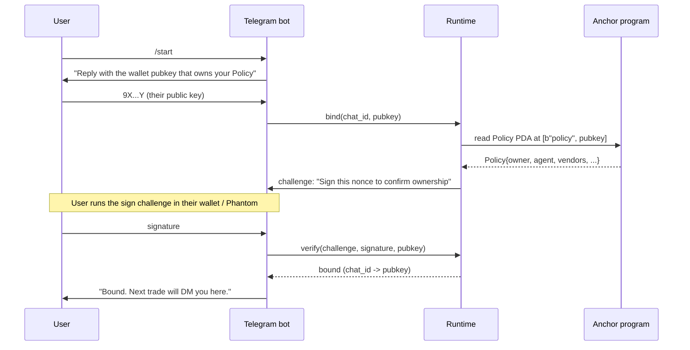

# Control Surface — Telegram Bot

> Frozen for D6. Implementation lands D8 (binding flow) + D9 (DM
> approve/deny). The bot is open-source under MIT, same as the rest.

The product's control surface is Telegram, not a web dashboard. The
founder persona described in SPEC.md is time-poor and reachable on
their phone, not behind a laptop with the dashboard open. Every
decision the agent is about to make needs an approve-or-skip nudge
that fits inside a phone notification.

The bot is non-custodial. It holds **no keys, no seed phrases, no
signing authority**. It stores only:

- the user's Telegram chat id,
- the public key of the wallet that owns the policy,
- an HMAC-signed binding token (see below).

Signing happens in the runtime's signer (which the user controls via
their keyfile or Phantom Connect) and on the Anchor program (which
never sees anything but the transaction).

## Wallet binding flow



The binding token is an HMAC over `(chat_id || pubkey || nonce)`
signed by the runtime's own key. On every DM the runtime re-checks
that the chat id maps to a pubkey and that the runtime-side signer
is the same as the wallet that owns the Policy PDA. The HMAC
defends against a Telegram account takeover replaying old binds.

The challenge proves *control* of the private key, not custody of
funds — the user signs a fixed string, not a transaction. The
runtime never sees the signature in plaintext at rest; it stores only
its boolean valid/invalid bit.

## Approve / deny DM template

When a `TradeIntent` passes the off-chain evaluator and crosses
`rules.notify_above_usd`, the runtime sends a DM:

```
Trade proposal — expires in 60s

Long SOL-PERP  0.10 @ 3.0x
Notional: $150 (cap $200)
Risk: $50 (loss cap today: $60 remaining)
Rationale: 15m RSI 27 + 1h trend up, stop -1.5%, target +3%

[Approve]    [Deny]
```

On `Approve`, the runtime proceeds with `authorize_spend` then the
venue CPI. On `Deny` or on a 60-second timeout, the runtime emits an
`AuditEventView(approved:false, reasonCode: 99 /* timeout */)`
locally; no transaction is sent.

## What happens on timeout

The 60-second window is enforced by `Promise.race` inside the
runtime's `telegram/notify.ts`. On timeout:

1. The intent is dropped.
2. The runtime emits an off-chain `AuditEventView` with reason 99.
3. The dashboard shows the dropped trade with a red banner
   "Timed out — would have been approved by policy".
4. No Telegram message is sent after the timeout; the user can
   `/status` to see what happened.

If the user taps *Deny* explicitly, the same flow runs with the
intent plus a `denied_at` timestamp. The bot never follows up with
a re-prompt for the same intent — timeouts and denies are terminal.

## What the bot does *not* do

- Does not hold keys. Cannot sign transactions.
- Does not connect to a wallet in any meaningful way. The challenge
  step proves control of a pubkey, but the bot never asks for or
  receives a private key, seed phrase, or session token.
- Does not initiate trades on its own. It only reacts to intents
  that the runtime has already pre-approved against the policy.
- Does not store PnL. PnL is on-chain in `AuditEvent` and surfaced
  via `apps/dashboard` (read-only).

## Commands

| Command | Effect |
|---|---|
| `/start` | Begin the binding flow. |
| `/bind <pubkey>` | Resume binding from step 2 if interrupted. |
| `/status` | Print last 5 audit events for this wallet. |
| `/positions` | List open positions across all whitelisted venues. |
| `/kill` | Toggle the `killSwitch` field on the Policy PDA (D7 stretch). |
| `/help` | Print command list. |

`/kill` is the only command that mutates state. It calls a new
`toggle_kill_switch` instruction on the Anchor program (D7) and
flips `policy.kill_switch: bool`. While `kill_switch == true`, every
`authorize_spend` returns `REASON_DRAWDOWN_TRIPPED` (7) regardless
of other rules.

## Open questions deferred to D8

- Do we run the bot in the same Node process as the runtime, or as
  a separate `apps/bot` that talks to the runtime over localhost?
  Default plan: separate process so the runtime can boot without a
  Telegram token (useful for tests). Resolved D8.
- Do we ship a Telegram-Mini-App fallback for the bind flow? Default
  plan: no, defer to v2. Resolved D8.